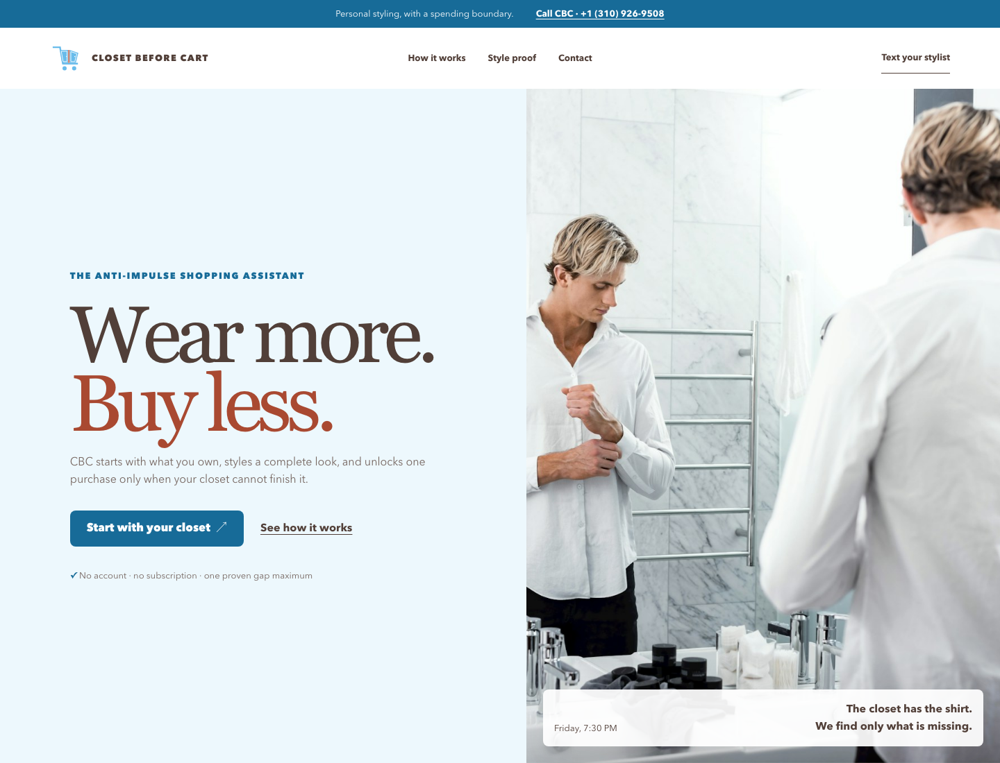
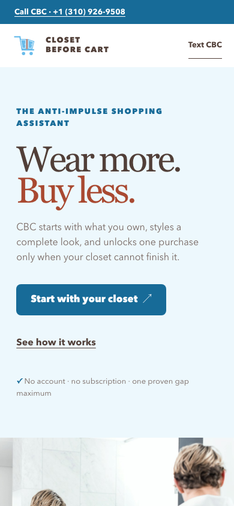

# Closet Before Cart: prove the gap before buying

Closet Before Cart (CBC) is a closet-first shopping experience and iMessage stylist. Its editorial storefront turns an occasion into a wearable look, checks what someone already owns, and asks permission to buy only one proven missing piece.

[](https://www.typescriptlang.org/)
[](https://nodejs.org/)
[](#testing)
[](LICENSE)



<p align="center">
  
</p>

## Live demo

<https://closet-before-cart.vercel.app/>

The public page is a responsive editorial storefront with real fashion photography, an explanation of CBC's closet-first process, a live Style Proof, one bounded recommendation, and direct call/text access at **+1 (310) 926-9508**. The full iMessage journey uses an allowlisted Linq sender, so judges can watch the recorded run without needing private credentials or a test card.

## What CBC does

A user sends one reference photo, six wardrobe photos, and an occasion through iMessage. OpenAI turns the wardrobe photos into typed evidence and renders an outfit preview. A deterministic rule engine then makes one of three decisions:

- `STYLE_READY`: the wardrobe satisfies the brief, so shopping stops.
- `GAP_FOUND`: exactly one required garment category is missing.
- `MORE_EVIDENCE`: CBC needs a clearer or missing photo before it can decide.

OpenAI never decides that the user should spend money. Only a signed `GAP_FOUND` Style Proof can unlock one quote and a matching Prava sandbox approval.

## Why it is different

Most shopping agents start with a product search. CBC starts with the user's closet. It can recommend an outfit without buying anything, and it refuses to open payment unless a machine-checkable rule identifies one missing category.

The demo brief is specific: Friday wedding, no black, one new item maximum. CBC found that the shirt and trousers worked, but formal footwear was missing. It then asked for department, US shoe size, and budget before creating a $29 sandbox approval.

## Verified integration status

| Boundary | Result | Evidence |
|---|---|---|
| Linq iMessage | Passed | A signed seven-image inbound message completed the deployed workflow. CBC showed typing while it processed the case and replied in the same chat. |
| OpenAI | Passed | The production path returned structured garment evidence and a generated outfit preview. The model could not issue the spending decision. |
| Style Proof | Passed | The deterministic engine identified one footwear gap and bound a new signed proof to the exact quote. |
| Prava sandbox | Passed | A fresh $29 USD session completed. The callback was stored as `APPROVED` with no safe error code. |
| CBC UCP profile | Live | `/.well-known/ucp` publishes CBC's shopping capabilities. |
| Commerce | Pinned fallback | The judged payment uses an explicit `PINNED_DEMO` quote because the tested live catalogs did not provide a reliable exact wedding-shoe match. |
| Vercel and Postgres | Passed | The webhook, proof, preview, approval-launch, callback, idempotency, and durable status paths are deployed. |

The Prava result is a sandbox permission, not a merchant order. CBC does not claim live stock, delivery, settlement, or fulfillment.

See [reports/closet-integration-spike.md](reports/closet-integration-spike.md) for the sanitized provider record.

## Product rules

- The model may describe garments and render a preview. It cannot unlock payment.
- `STYLE_READY` never reaches quoting or Prava.
- A valid `GAP_FOUND` proof can name only one missing category.
- Changing the quote, amount, merchant, variant, or brief invalidates the approval boundary.
- CBC deletes raw wardrobe photos after extraction and rendering.
- The generated image is an editorial preview, not a fit guarantee.
- A pinned quote is not live availability.
- A Prava sandbox approval is not a merchant order.

## Recorded journey

1. Send one reference photo and six wardrobe photos in one iMessage.
2. Include: `Friday wedding, no black, one new item maximum`.
3. CBC shows typing while it extracts the wardrobe and renders a preview.
4. CBC explains the exact gap, then asks for department, US shoe size, and maximum budget.
5. Reply with the shopping details.
6. CBC issues a fresh $29 pinned demo quote and sends a preview-safe launch page.
7. Tap `Open Prava approval` and complete the sandbox verification.
8. Prava returns to CBC. CBC records the session as approved and labels it as sandbox-only.

The direct iMessage route is restricted to the configured test sender and recipient. This is intentional. It keeps webhook replay and payment testing bounded during judging.

## How it works

```text
iMessage user
  |
  v
Linq signed webhook -----> durable event claim in PostgreSQL
  |
  v
temporary media intake --> OpenAI extraction and preview
  |                              |
  |                              v
  |                        typed garment evidence
  +------------------------------+
                                 v
                    deterministic style-gap engine
                       |          |          |
                       |          |          +--> MORE_EVIDENCE
                       |          +-------------> STYLE_READY, stop
                       +------------------------> GAP_FOUND
                                                    |
                                                    v
                                      signed proof + pinned quote
                                                    |
                                                    v
                                       Prava sandbox approval
                                                    |
                                                    v
                                      callback + labelled receipt
```

## Technology

| Layer | Technology |
|---|---|
| Chat | Linq iMessage API and signed webhooks |
| Vision and preview | OpenAI Responses and image generation APIs |
| Decision boundary | TypeScript deterministic rules and signed Style Proofs |
| Payment permission | Prava sandbox hosted sessions |
| State | Neon Postgres |
| Workflow | Inngest |
| Hosting | Vercel Functions and static output |
| Protocol | Universal Commerce Protocol profile |

## API reference

| Method | Endpoint | Purpose |
|---|---|---|
| `GET` | `/` | Public CBC editorial storefront and Style Proof demo. |
| `GET` | `/.well-known/ucp` | Public CBC UCP profile. |
| `GET` | `/api/webhooks/linq` | Linq webhook readiness check. |
| `POST` | `/api/webhooks/linq` | Signed, allowlisted, idempotent Linq intake. |
| `GET` | `/api/proof?id=...` | Stored Style Proof view. |
| `GET` | `/api/preview?case=...` | Generated case preview. |
| `GET` | `/api/approval-launch?target=...` | Preview-safe handoff to the one-time Prava page. |
| `GET` | `/api/prava-return?case=...` | Prava return and durable completion event. |

## Testing

```bash
npm install
npm run verify
./verify.sh phase-5
```

The 142 tests cover webhook signatures, replay limits, sender allowlisting, idempotency, media boundaries, garment normalization, deterministic style decisions, proof signing and expiry, quote binding, Prava sessions and callbacks, storefront rendering, contact paths, UI state isolation, output escaping, and production packaging.

## Running locally

Requirements: Node.js 24 or newer and npm.

```bash
npm install
npm run build
python3 -m http.server 4173 --directory .build/public
```

Open <http://127.0.0.1:4173>.

The public proof page does not need provider credentials. Copy `.env.example` to `.env.local` only when testing private integrations. Never commit that file or card data.

## Project structure

```text
api/                      Vercel webhook, UCP, proof, preview, and Prava routes
app/                      typed route contracts
brand/                    approved wardrobe-cart logo system
db/migrations/            PostgreSQL schema
design/guidelines.md      selected Open Wardrobe visual rules
docs/images/              current production screenshots
public/                   static UI and brand assets
reports/                  sanitized integration evidence
src/adapters/             Linq, OpenAI, Prava, persistence, and commerce boundaries
src/domain/               proof, style, payment, retention, and state logic
src/presentation/         state-aware Style Proof renderer
tests/                    unit, contract, database, workflow, and UI tests
```


## License

MIT. See [LICENSE](LICENSE).
